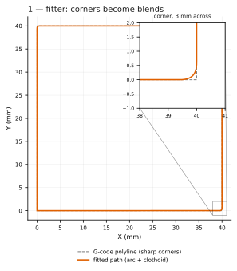
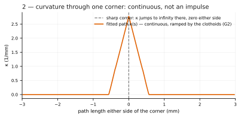
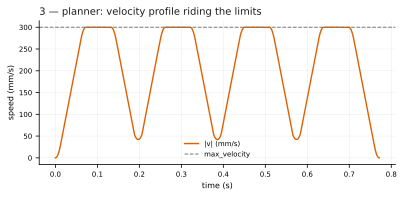
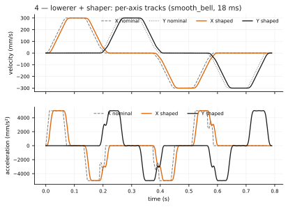
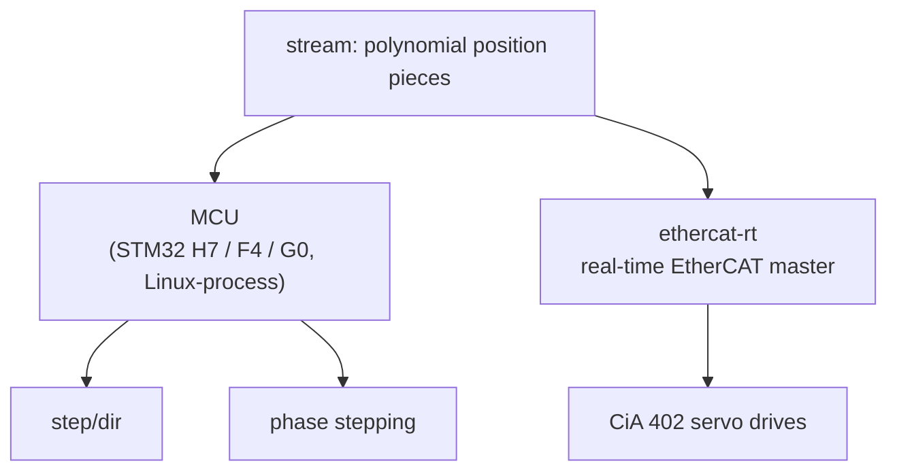

# Serval

Serval is a fork of [Kalico](https://github.com/KalicoCrew/kalico) that
**replaces the motion stack** with a streaming, jerk-limited planner
written in Rust.

**Why:** print faster without giving up quality, by dropping the
approximations classical planners are built on — trapezoidal profiles,
instant velocity-vector changes at corners, one accel-to-decel ratio — and
stating every limit explicitly so it applies where it actually binds.
**Second goal:** keep the machine model small. A printer is a set of axes
with relations between them; the planner does not know what any axis is for.

Everything here is under active development. Interfaces, config formats,
and some design decisions may still change. Upstream Kalico's feature list
and install instructions: [README_KALICO.md](README_KALICO.md).

**Honest per-feature status** — what is solid, what is only verified in sim,
what is exploratory, and the known limits:
[docs/Feature_Status.md](docs/Feature_Status.md).

**Documentation map:** [installation and migration](docs/Quickstart.md),
[hardware support](docs/Hardware_Support.md), [motion configuration](docs/Config_Reference_Motion.md),
[architecture](docs/Architecture.md), and [developer workflows](docs/Development.md).

**Play with it in your browser** — the actual pipeline compiled to WASM;
paste G-code, tweak config, watch it re-plan:
[dderg.github.io/kalico/playground](https://dderg.github.io/kalico/playground/).

**Try it on your printer** — add a remote, switch the branch, build,
flash, migrate the config: [docs/Quickstart.md](docs/Quickstart.md).

**Host requirements** — lock motion memory and configure swap before running a
printer: [docs/Installation.md#host-memory-requirements](docs/Installation.md#host-memory-requirements).

---

## The corner problem

G-code arrives as straight segments meeting at sharp angles, and the
planner must decide how fast the toolhead may pass through each junction.
Classic Klipper decides with `square_corner_velocity`: at the junction it
picks a speed at which an imagined "cornering radius" would keep the
centripetal acceleration inside `max_accel`, and the toolhead switches
from one velocity vector to the other at that speed. The corner itself
takes zero time and zero distance in the plan — the direction change is
instantaneous. Klipper developer Dmitry Butyugin, on
[why there is no right value](https://klipper.discourse.group/t/square-corner-velocity-what-is-the-reasonable-range-of-values/7298/14):

> the model "is not really particularly physical (it calculates and uses
> the cornering radius that's just a model and does not exist in practice)"

The consequences fall out either way you turn the knob:

- **Raise it** and "the kinematics of the toolhead at corners becomes
  'borked'". Steppers cannot change velocity sharply, so the machine
  performs the acceleration itself — through belt and frame flex, entirely
  unaccounted for by the planner. That shows up as ringing.
- **Raise it** and input-shaping smoothing grows rapidly along with it.
- **Lower it** and linear pressure advance falls apart at low speeds, so
  corners ooze.

The thread's own conclusion: there is no right value; 5 is a compromise
between two failure modes.

**The fork's answer: replace the phantom radius with real geometry.**

- **Sharp junctions become arc and clothoid easing blends** with continuous
  curvature (G2), inside an explicit corner-deviation budget — the blend is
  a real path the machine can actually follow.
- **Budget is configured directly** (`corner_deviation`), or derived from a
  classic `square_corner_velocity` value.
- **Cornering speed follows from axis limits and the actual local
  curvature** of the rounded path — not from a velocity carve-out at the
  corner.
- **No velocity jump exists anywhere in the plan.** There is nothing left
  for the frame to absorb on the planner's behalf.
- **Curved input is accepted as-is:** G5 / G5.1 cubic Bézier moves.

Below, the real planner driven over a 40 mm square
(`tools/plot_pipeline_figures.py`; deviation budget 0.2 mm, exaggerated
for visibility). The fitter rounds each corner into a blend:



A sharp corner is a curvature impulse; the clothoids ramp κ up and back
down instead:



---

## The planner

**Four streaming stages, each a pure stage on its own thread.** Entry
point: `setup_pipeline` in `rust/motion-core/src/worker.rs`.

- **Fitter** — turns incoming moves into smooth geometry (above).
- **Planner** — finds a jerk-limited velocity profile over a lookahead
  window.
- **Lowerer** — emits per-axis piecewise-polynomial position tracks.
- **Shaper** — applies the per-axis post-processor chains.

What the planner does with limits:

- **Limits apply along the path, not per move.** Where the gantry's accel
  limit binds, the profile rides it; where an extruder flow limit takes
  over, it rides that instead.
- **Jerk is currently a per-axis constraint** like velocity and accel.

The planned profile over the same square — riding `max_velocity`, dipping
only as far as each blend's curvature requires:



**On jerk, honestly:** jerk limiting was the initial aspiration for this
fork. Recent testing suggests it may not be worth it — it only costs print
time, while the smoothing post-processors bound the same physical quantity
more directly, and in practice a short bell kernel (~2 ms) seems to be all
the smoothing a fast machine needs. Research ongoing; the limit is
enforced today.

---

## Axes

**There is no toolhead and no extruder concept internally.** A printer is a
set of axes; a kinematics section maps them onto motors; an axis may
declare that it follows other axes.

```
[kinematics]
type: cartesian
axis_x: x
axis_y: y
axis_z: z
x_motors: x
y_motors: y
z_motors: z

[axis e]
follows: x, y, z
motors: extruder
post_processors: pa
```

- **A follower axis pays out its commanded displacement** in proportion to
  the distance actually traveled along the path of the axes it follows.
- **Nothing knows it's an extruder.** The extruder is just the obvious
  example.
- **Following is measured along the real 3D path**, so vase mode, retract
  while z-hopping, and extrude-only moves need no special handling — they
  are moves.
- **Global limits stay classic**, in `[printer]`: `max_velocity`,
  `max_accel`, `max_jerk`, `square_corner_velocity`, `max_z_velocity`,
  `max_z_accel`.

---

## Post-processors

**Input shaping and pressure advance are the same kind of object:** a
linear operator applied to one axis's motion. Declared the same way,
chainable.

```
[post_processor smooth]
type: smooth_bell
smooth_time: 0.018

[post_processor is]
type: smooth_mzv
frequency_hz: 43

[post_processor pa]
type: linear_pressure_advance
k: 0.045

[axis x]
post_processors: smooth

[axis y]
post_processors: is

[axis e]
follows: x, y, z
post_processors: pa
```

Eight types exist today (registry: `rust/trajectory/src/algos/mod.rs`):

| Type | Parameters | What it does |
| --- | --- | --- |
| `smooth_bell` | `smooth_time` | plain low-pass kernel |
| `smooth_triangle` | `smooth_time` | plain low-pass kernel |
| `smooth_zv` | `frequency_hz` | frequency-targeted smoother; kernel duration derived from the target |
| `smooth_mzv` | `frequency_hz` | same, modified-ZV kernel shape |
| `linear_pressure_advance` | `k` | sharpens the extruder signal to compensate pressure lag |
| `tanh_pressure_advance` | `linear_advance`, `nonlinear_offset`, `linearization_velocity` | saturating advance law, `s(u) = tanh(u)` — reaches the bound quickly |
| `recipr_pressure_advance` | same | same law with `s(u) = u/(1+\|u\|)` — approaches the bound far more gradually |
| `mode_inverse` | `frequency_hz`, `damping_ratio` | inverts an identified second-order resonance (e.g. belt compliance) |

- **Why saturating pressure advance:** the law is
  `linear_advance·v + nonlinear_offset·s(v / linearization_velocity)`, so
  commanded advance stops growing once flow is past the linearization
  velocity. The nozzle pressure response flattens there and a purely
  linear model over-advances.
- **`mode_inverse` needs a preceding kernel.** It makes the toolhead
  follow the nominal path with the residual scaling with model error, and
  must be preceded by a short smoothing kernel; the config compiler
  enforces that ordering.
- **Limits apply to the chain's output** — the signal the motor actually
  receives — not to the nominal command. Pressure advance spikes extruder
  velocity during acceleration, so corners where that spike would exceed
  the flow limit are slowed, and only those.
- **Parameters are tunable at runtime.** A live update recompiles the axis
  chains, revalidates them, and swaps them into the running planner.
  Corner deviation and accel caps change the same way.

The per-axis tracks the executors receive, nominal vs the chain's output
(`smooth_bell`, 18 ms):



Design detail: [docs/rewrite/shaper.md](docs/rewrite/shaper.md).

---

## The MCU plays trajectory, not steps

**Mainline precompiles a queue of step times. Serval streams the actual
trajectory, and the executors evaluate it.**

- **The host streams polynomial position pieces** — each axis's final
  motion, planned, followed, and shaped.
- **The MCU evaluates them at a fixed sample rate** and produces step
  edges or phase currents from the true continuous position.
- **The MCU holds the trajectory**, not a precompiled queue of step times.
  That is what makes smooth phase stepping possible — currents derived from
  a true continuous position rather than from discrete step events — and
  the same stream feeds servo drives their position setpoints.
- **Targets:** STM32 H7, F4, G0, and a Linux-process MCU. The motion
  sample rate is a per-target build option.

Kinematics is where axes meet hardware: axes are what the planner thinks
in, motors are what the printer is built from, and a kinematics module
connects the two. The planning side does not know what executes the
trajectory. Per-drive status:
[docs/Feature_Status.md](docs/Feature_Status.md).



---

## EtherCAT servos

**Industrial servo drives as first-class motors.** The same trajectory
stream that drives a stepper's phase currents feeds servo drives their
position setpoints — and doing it over EtherCAT buys things step/dir
cannot express:

- **The drives are synchronized in time.** EtherCAT distributed clocks put
  every drive on one clock, executing one trajectory time-base. Motors
  that must agree — two motors on one gantry (AWD), A and B on a CoreXY —
  are in sync by construction, not by hoping step edges line up.
- **True physical-model torque feedforward, sent in every frame.** Serval
  identifies the axis dynamics (inertia, friction) and computes each
  motor's torque every cycle. On a CoreXY that means A and B receive
  *different* torque depending on the direction of motion — something a
  step pulse has no way to say.
- **Drive tuning is configuration.** Loop gains are written into the
  drive's object dictionary at startup from the printer config —
  version-controlled and diffable, not trapped in a vendor GUI. A
  calibration suite surrounds it: gain and inertia identification,
  tracking measurement, telemetry capture to file, and a live dashboard.
- **Sensorless homing** on servo axes via a torque threshold.

Built on the standard CiA 402 drive profile; tested so far on
StepperOnline A6 drives.

**Bring-up** takes a real-time host: the EtherCAT master runs on a
Raspberry Pi 5 under a PREEMPT_RT kernel with the IgH master and the
native `ec_macb` driver.

- Master and kernel:
  [docs/rewrite/ethercat-igh-macb-install.md](docs/rewrite/ethercat-igh-macb-install.md)
- Drive side:
  [docs/rewrite/ethercat-bench-bringup.md](docs/rewrite/ethercat-bench-bringup.md)
- Feedforward and dynamics identification:
  [docs/rewrite/servo-feedforward.md](docs/rewrite/servo-feedforward.md)
- Tuning dashboard and the full `SERVO_*` command reference:
  [serval-dashboard](https://github.com/dderg/serval-dashboard)

---

## Homing and probing

- **Guarded run toward the endstop**, planned like any other move.
- **On trigger, the trip is matched against the streamed trajectory** to
  reconstruct the exact trip position (including overshoot) and re-anchor
  the axis.
- **Beacon users must install the [Serval-compatible
  `beacon_klipper` fork](https://github.com/dderg/beacon_klipper).** The
  upstream module targets Klipper's motion APIs and is not compatible with
  Serval's rewritten motion stack.
- **Endstops on remote MCUs and probe-style triggers** (Beacon and
  similar) use the same mechanism.
- **Sensorless homing** exists on the servo path via a torque threshold.

---

## Development infrastructure

**Most day-to-day verification happens off-hardware.**

- **Simulator** (`tools/sim/`) — runs the real firmware binaries and the
  real host against faked hardware on virtual clocks, in Docker.
  End-to-end G-code runs, homing and probing tests, branch-vs-branch
  comparison. Part of CI.
- **Trajectory snapshot tests** (`snapshots/`) — drive the real planner
  over a config × G-code matrix and diff the full output trajectory
  against committed baselines. Browser gallery for reviewing before/after.
- **Playground** — the actual pipeline compiled to WASM:
  [dderg.github.io/kalico/playground](https://dderg.github.io/kalico/playground/).
  Paste G-code, tweak config, watch it re-plan in the browser.
- **Structured logging** — host and MCU emit structured events
  (`events/*.jsonl`) instead of free-form log text, queryable with
  VictoriaLogs. The MCU keeps a diagnostic ring and dumps prior-crash
  forensics on reboot.

---

## Deeper reading

The architecture documents in [docs/rewrite/](docs/rewrite/) describe the
design and are kept closer to the code than this file. **When they
disagree, trust the docs and the code.**

Expect breakage and change.
