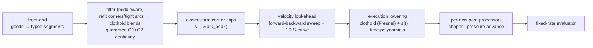

# Architecture — motion-pipeline rewrite

The decided design, authored from working through it (not a brain dump). Companion to `SPEC.md`. Where a claim was *not* pressure-tested in discussion, it is marked **[carried]** — those came from the original map and are provisional.

## Pipeline

Each arrow is a testable interface. The IR is progressively enriched: geometry → +caps → +timing. The MCU/execution transport and the structured-logging layer below the evaluator are reused unchanged.

## Representation (IR)

- **Two channels, not one.** A move is a *spatial path* plus a *follower channel* (extrusion). κ(s) describes only the path; it says nothing about E. This is already built in code (`FollowerDemand { axis_index, ratio }`); preserve it.
- **Typed segment library:** `enum Segment { Line | Arc | Clothoid }`. Each is closed-form in design space — no generic numerical integration, no `dyn`.
- **κ(s) is a derived scalar field, not the generative truth.** The typed segment is the source of truth; κ is read off it for the velocity law. The justification for centring on curvature is **"curvature is the coordinate the constraint is written in"** (`v = √(a/κ)`), *not* the fundamental theorem of plane curves (which is a 2-D theorem and oversells κ as "the representation").
- **Pure retraction** (`G1 E-` with no XYZ) is a **virtual-path** segment: zero spatial length, the follower's own displacement becomes the move's arclength. Already implemented (`try_new_virtual`, odometer over the post-shaping signal).
- **Clothoid closed-form split.** A clothoid's position needs Fresnel integrals (not elementary), but its **κ(s) is linear and closed-form**. Velocity planning is closed-form in κ; Fresnel is needed only at **execution lowering**. This is the cleanest vindication of the design/execution split, and it removes the current per-segment 1024-point arc-length table.
- **The velocity planner's read-contract is κ-space only.** Per segment: `(L, κ(0), κ(L), σ=dκ/ds)`; per junction: `(κ⁻, κ⁺, σ⁻, σ⁺, G1-flag)`. Position/Fresnel is *barred* from the planner (a separate trait owned by execution lowering — enforce by module privacy). Because κ is linear on a clothoid, `κ_peak` is the closed-form **endpoint** extremum — no root-find; this is exactly what dropping G5 (cubic-in-s κ) buys. **"Velocity planning needs only κ" is phase-qualified:** the jerk-unaware sweep (build step 5) reads only κ; the jerk-aware lookahead (step 6+) additionally reads `σ`. So `σ` is carried on the contract **from day one** — populated-and-finite but *uncalled* in v1 — making the v1→v2 jerk upgrade purely additive (a new consumer, no IR→IR schema migration; "leave the hook, don't wire it yet"). The one cross-seam fail-loud invariant is **L-consistency** (`σ == (κ(L)−κ(0))/L`), checked at the fitter→planner seam — a degenerate IR never reaches the planner.

## Fitter (middleware)

- **Shaper-agnostic by authority, not by approximation.** The fitter never consults a shaper model and the planner never limits acceleration to avoid ringing. `max_accel` is the user's sovereign knob — chosen empirically for no ringing, because no resonance measurement is perfect. Clothoid smoothness *happens to* help the shaper; it is a one-way gift, never a negotiation. (This deliberately drops the original map's "shaper-aware middleware / post-shaper within δ" goal — see Non-goals.)
- **Inputs do two different jobs.** `δ` (junction deviation) bounds the *geometry* — pick the gentlest clothoid that rounds the corner within δ, which maximises corner speed. `max_accel` is the *criterion for whether a corner even needs a blend* (a corner already takeable at full speed is left alone) and sets the *speed* on the blend via `v=√(a/κ)`. Not redundant.
- **Output guarantees:** all segment boundaries are collinear (G1), and curvature-continuous (G2) **wherever geometry permits** (move starts excepted — nothing to be collinear to). Tight arcs get clothoid entry/exit transitions; gentle arcs pass through. This is what "refit the G1 stream into continuous motion" means. Where a residual κ-step survives (no room within δ), it is **not** a failure — the velocity solver caps speed there (see Continuity and jerk). The fitter is a cost-reducing optimizer, not a hard G2 gate.
- **Chains of corners → one continuous κ(s) profile.** Back-to-back corners are not rounded independently. A clothoid is "linear κ(s)"; a run of corners is therefore a single **continuous, piecewise-linear κ(s)** (a clothoid spline) drawn within δ of the whole polyline. Through a dense chain κ stays continuous and need not return to zero between neighbors — which removes the acceleration discontinuity, avoids the needless decelerate-reaccelerate between corners (faster), and deletes the blend-overlap special case (one curve, nothing to collide). Out of room ⇒ the κ profile just stays elevated (smaller / merged clothoids), not a collision. This is the same problem as faceted-chain-vs-corner detection: a faceted curve wants one smooth low-κ fit, isolated corners each want their own κ bump.
- **No facet-vs-corner classifier — one objective.** You only have the polyline, not the slicer's intent, and you don't need it. Work in tangent-angle `φ(s)` (`κ = dφ/ds`); the polyline is a **staircase** `φ_poly` that jumps `θ_i` at each vertex. The fit is simply *the gentlest κ within the δ-tube around `φ_poly`*. To first order lateral deviation ≈ `∫(φ − φ_poly) ds`, a convex tube constraint. Restrict to the clothoid-spline family and minimise a convex curvature functional, principally `∫(dκ/ds)²` — minimising curvature *rate* is what selects linear-κ (clothoid) pieces, with breakpoints where the tube goes active; it is a **banded, effectively non-iterative QP**. `∫(κ′)²` is not arbitrary: lateral jerk ∝ `v³κ′`, so the fit objective *is* a lateral-jerk-energy minimiser — the gentlest geometry the machine can run, which is the fitter's whole reason to exist. Faceted arc ⇒ the tube hugs the arc ⇒ fit ≈ constant κ (an arc); sharp corner ⇒ δ binds ⇒ κ peaks at `κ_peak(δ)`. **Same objective, no branch**; "facet vs corner" only *describes* the output, it is never an `if`.
- **Line↔arc seams = a clothoid half.** A line meets an arc with a κ-step `0 → κ_arc`; bridge it with a single clothoid ramping κ linearly `0 → κ_arc` (a *half*, not a symmetric pair — the classic transition spiral). A line→arc→line fillet is a trapezoidal `κ(s)`: ramp up, flat at `κ_arc`, ramp down. The transition shifts the arc inward (road-design offset `p`); that shift must fit within δ — the same tube. Whether to insert it is the same speed-cap economics as a corner: a gentle arc's small `κ_arc` makes the seam's `a_c = v²κ_arc` step cheap (cap barely binds) so it passes through; a tight arc's large step pays, so it earns entry/exit halves. This makes CAP-3's "tight arcs get clothoid entry/exit transitions; gentle arcs pass through" quantitative, and covers explicit slicer G2/G3 arc seams, not just fitted corners.
- **Locality / streaming.** A vertex couples only within its δ-bounded blend reach, so chains are found by a local O(n) scan: per corner the within-δ half-length `L_c(θ,δ)`; if `L_c(i)+L_c(i+1) <` the segment between them, κ returns to 0 — a chain anchor. The fit runs per chain; a faceted full circle is one chain but trivially constant-κ. The fitter's revision horizon is δ-bounded, **symmetric to the velocity braking-length horizon** — a late tighter segment perturbs κ only within reach, never the whole tail. The κ(s) it emits is piecewise-linear, which is exactly the `{Line | Arc | Clothoid}` alphabet (slope-0-value-0 = Line, slope-0 = Arc, slope≠0 = Clothoid) — no new segment type.
- **Knob continuity with Klipper:** Square Corner Velocity reused — `SCV = √(a_max/κ_peak(90°, δ))`. The corner-angle dependence is closed-form clothoid geometry (`κ_peak(angle, δ)`), not an empirical ratio.
- **Closed forms (research-grounded, 2026-06-18).** Corner peak curvature: `κ_peak ≈ θ²/(24δ)` (the road-design shift formula), accurate to a few % for θ ≲ 60° and a Newton seed reaching the Fresnel-exact value in ~2 steps. Line→arc transition spiral: shift `p ≈ L_s²·κ_arc/24`, spiral angle `φ_s = L_s·κ_arc/2`, parameter `A=√(R·L_s)` — the shift `p` is the deviation the seam spends, bounded by δ. Implementation vehicle: the open-source Bertolazzi-Frego `Clothoids` library (O(n) G2 clothoid splines, ~42 µs/corner biclothoid fits in the CNC literature). The CNC corner-smoothing work (Shahzadeh 2018, Sencer 2015) solves the same geometry for cycle-time; only its *tolerance-as-product-spec* framing differs — the geometry transfers unchanged. Klipper's junction-deviation model is a virtual-circle *speed* heuristic with no actual blend, and it provably throttles faceted arcs (issue #4228) — the exact artifact this fitter removes.

## Continuity and jerk

- **Acceleration continuity is layered, and the solver owns jerk.** Lateral (centripetal): the fitter keeps κ continuous wherever geometry permits (clothoids / clothoid-spline). Any residual κ-step it cannot remove becomes a closed-form **velocity cap** `v ≤ √(a/κ)` at the step — because `a_c = v²κ`, slowing shrinks the acceleration step, degrading gracefully to mainline corner-capping rather than failing loud. Tangential (`a_t = v·dv/ds`) = the velocity planner's job, automatic at a **single shared sample node** in the joint sweep. So the velocity solver is the safety net (S-curves + speed caps) and the fitter is a cost-reducing optimizer; the two **compose** — a smarter fitter only reduces how often the cap binds. This stays decoupled (no SOCP): the caps are precomputed closed-form, not co-optimized with timing.
- **Lateral jerk is free.** On a clothoid the acceleration vector stays at magnitude `a_max` and just *rotates* — braking → centripetal (apex) → forward — so lateral jerk is finite and bounded by the geometry. No lateral-jerk constraint in the planner. (At a line→clothoid boundary, κ is continuous but `dκ/ds` steps: a finite jerk step, fine for G2.)
- **Two independent jerk channels — don't conflate them.** Tangential jerk ∝ `s⃛` is owned 100% by `s(t)` (the S-curve); lateral jerk ∝ `(dκ/ds)·ṡ³` is owned by `dκ/ds` (the curvature-profile slope). C1 *velocity* continuity buys bounded *tangential* jerk only — it does **not** launder a `dκ/ds` step, which lives in the geometry. The {Line|Arc|Clothoid} alphabet gives piecewise-**linear** κ, so `dκ/ds` is piecewise-constant and *steps* at every blend seam: the alphabet is the **projection** of the `∫(dκ/ds)²` Minimum-Variation-Curve onto a closed primitive set (the free MVC minimiser is piecewise-**cubic** κ, i.e. G3 / `dκ/ds` continuous), and the projection residual *is* those bounded lateral-jerk steps. The honest phrasing is "the alphabet-constrained MVC," not "PWL κ *is* the MVC."
- **Extrusion makes no geometric demand — it is a tangential-jerk bound.** Extrusion-consistency does not require G2 or G3. PA commands `E_pa = E_nominal + τ·v`, so extruder accel carries `τ·(da/dt) = τ·s⃛`; the "post-PA acceleration too violent on the extruder" failure is bounded directly by the S-curve's tangential-jerk limit (derived bound `|τ·ratio·j_tangential| ≤ a_extruder_transient_max`; `FollowerDemand` unchanged; a step-6 concern). So extrusion drops out of the alphabet-sufficiency question entirely. **Sufficiency reduces to a pure surface-finish question:** do the bounded lateral-jerk *steps* leak broadband energy into the input shaper's *inter-notch* bands (the one thing a notch filter cannot null)? The goal is **bounded** lateral jerk, not zero / not G3 — the shaper owns resonance. Decide it by *measuring* post-shaper lateral-accel spectral energy at blend seams on representative output; below the floor, ship the alphabet; above it — and only then, by the throughput non-negotiable — upgrade to a piecewise-cubic-κ primitive (G3 clothoid-spline / PH-quintic). Does not block V1. *(Grounded: segment-IR contract research pass, 2026-06-18.)*
- **Tangential jerk is a 1D S-curve in the lookahead — not a post-processor.** The only infinite-jerk source left is the **accel→decel reversal** (`+a_max → −a_max`), which lands with *no room* on a short straight between two features. A post-processor cannot fix this (it cannot lower a speed it already committed to). The lookahead can: on a short straight it **trims peak velocity** so the bounded-jerk reversal fits. This costs a sliver of time and zero geometry change.
- **Why it must be lookahead (causality).** Both jerk-rounded ramps take more time; the difference is direction. Acceleration smoothing borrows from *future* cruise (free). Deceleration smoothing borrows from *past* cruise (committed) — you must start braking sooner, which only foresight can reserve.
- **Jerk lives in `s(t)`, never in geometry.** The fitter owns the path; jerk-limiting only changes *when along the fixed path* you brake. Therefore it can produce **no geometric artifact** — its only costs are time and required braking length. *Timing* infeasibility (a segment that cannot absorb its own tangential smoothing) still fails loudly. A purely *geometric* overlap (two short segments whose clothoid entry/exit can't fit within δ) is a different thing and does **not** fail — the solver caps speed at the residual κ-step (resolved; see the layered acceleration-continuity point above).
- **The jerk limit is real, not a never-bind guard.** Its purpose is to let `max_accel` rise to the no-ring ceiling. It binds on short straights (where it trims peak velocity) and barely binds on long ones.

## Velocity planning (replaces the SOCP)

- **No convex solver.** Once lateral handling is in the geometry (closed-form corner caps) and tangential jerk is 1-D, the velocity problem *separates* into the classic forward-backward integration TOPP + closed-form S-curve ramps. The current SOCP + SLP9 + iterative joining existed to handle jerk *coupled* with curvature; decoupling them removes it. **This is the real-time win.**
- **Why the single-pass sweep is sound (research-grounded, 2026-06-18).** Dong-Stori (2006) *proves* the two-pass bidirectional scan is globally optimal for acceleration + curvature ("state-dependent") constraints — our exact class — so a single forward-backward pass is optimal, not a heuristic. The dangerous TOPP switching-point failures (zero-inertia / dynamic singularities, Pham 2014) are *structurally absent* here: they arise from configuration-dependent effective inertia in articulated robots; a constant-mass Cartesian/CoreXY machine has none. The tangential 1-D jerk ramp is closed-form and provably time-optimal (seven-segment S-curve; Ruckig measures ~20 µs/axis, 100 % over 10⁹ cases). The price of *decoupling* lateral from tangential jerk (the cross-term `j_n = κ′v³ + 2κv·a_t` makes a fully-coupled solver slightly less conservative on `a_t` in high-κ regions) is small — coupled jerk costs only ~3–5 % over jerk-free (Anand 2024) — but is **unmeasured for FFF**, the one residual on the decoupling bet. **Guard:** a G1-but-not-G2 corner that slips past the fitter would make `√(a/κ)` collapse over a sub-segment arc length (Pham "discontinuity" switching point). The defence is **structural, not a grid resolution**: see the node-based sweep point below — every junction/apex is a node and `κ_peak` is read off the linear-κ closed form, so there is no sampled grid to "miss" the step; the open obligation is the node-coverage invariant (assert no κ-step lives mid-segment). The single backward pass can also be suboptimal on pathological alternating fast/slow runs (Klipper #662); a window-depth tradeoff to monitor.
- **The sweep is node-based — there is no planning grid.** Classical TOPP samples `s` on a uniform grid to *find* curvature peaks; we don't need it. Clothoid κ is linear ⇒ peak is a closed-form endpoint; arc κ is constant; junction caps are closed-form. So the sweep visits a finite node set (junctions ∪ clothoid apexes) with analytic constant-accel kinematics between — the old 1024-point arc-length table is *deleted, not replaced*. The only residual numerical integration is the step-7 limit-riding `1D ODE per clothoid` (local, adaptive). Jerk adds **no** grid: the S-curve is the closed-form seven-segment (Ruckig) solution — analytic breakpoints, not samples. Correctness rests on a **node-coverage invariant** (every junction/apex is a node; fail-loud on a mid-segment κ-step) plus an analytic-vs-numeric `κ_peak` equivalence test (the canary if a non-linear-κ segment ever sneaks in) — not on a cell-size contract. *(Clarified: segment-IR contract research pass, 2026-06-18 — "grid" in earlier drafts was a reflexive textbook-TOPP import; the execution-time fixed-rate evaluator is a separate time-grid, independent of planning.)*
- **Corner caps are precomputed, closed-form:** clothoid apex `v = √(a_max/κ_peak)`. Each clothoid also carries a *pointwise* cap `v ≤ √(a/κ(s))`; **the planner rides this pointwise limit curve, not the constant apex cap** (step 7, below).
- **The velocity profile over a clothoid is an output, not a local rule.** The same clothoid geometry can be traversed all-decel, all-accel, a dip, or cruise — the global sweep decides. Stop picturing "decel-in / accel-out"; picture a varying speed ceiling with one continuous line drawn under it.
- **Limit-riding is live (build step 7, implemented).** The step-5/6 per-move trapezoid (one constant ceiling + an independent double-S per move) is replaced by **one continuous `v(s)` per rest-bounded run** on the acceleration **disk**: in every accel/decel region `|a| = a_max` and the vector rotates — `a_c = v²|κ(s)|`, `a_t = √(a_max² − a_c²)`, `dv/ds = a_t/v`. A straight (κ=0) spends all of `a_max` tangentially and a clothoid trades it smoothly into centripetal toward the apex; because the fitter makes κ continuous at line↔clothoid seams and the planner holds `|a|=a_max` across them, the entry-straight decel and the clothoid decel are **one ramp** (seamless). Line/arc reaches are closed-form (`v²=(a/κ)sin(2κs+φ)`); the clothoid is the lone **adaptive 1-D ODE**. The step-6 tangential-jerk S-curve is retained and composes by **min** (it bounds the magnitude ramps `|a|:0⇄a_max`; the disk bounds the rotation) — a pure straight recovers step 6 and `J=∞` recovers the pure disk. Gain is measured: `VelocityReport.traversal_time_s` + `limit_ride`. *Deferred:* folding jerk into the rotation (bounding `da/dt` through the swing); per-axis/anisotropic body. (`rust/geometry/src/velocity/{disk.rs,scurve.rs}`.)
- **Tighter-next-feature = ordinary backward propagation.** A tighter corner B's lower cap propagates upstream; if A's exit is within coupling range, A simply never accelerates out. If even max jerk-limited braking can't shed enough speed in the available distance, the backward pass continues past A (lowering A's cap too) until it finds slack or a full stop.
- **Coupling horizon = worst-case braking length.** "Reset at every full stop" is insufficient — normal printing rarely reaches `v=0` (a continuous contour or vase spiral never does), so stops do not bound the cascade. The window is instead the distance to brake from the velocity cap to a stop under the tightest axis accel, padded for the jerk-limited ramp. The invariance guarantee: a node earlier than that backward reach cannot be changed by any downstream terminal, so re-solving the suffix from it reproduces the downstream profile — that node is safe to commit, and the freeze point snaps back to the nearest corner within reach. Moves past the committed boundary are already streamed to the MCU and never re-planned. The current planner already does exactly this (`bounded_freeze_idx` in `rust/trajectory/src/streaming/state.rs`, `braking_time = k·v_cruise/a_brake`); the rewrite carries the mechanism forward.

## Shaper & pressure advance (execution)

- Stay **per-axis, time-domain post-processors at execution.** Never baked upstream of velocity planning.
- The **extruder follower advances on the post-shaper (realized) velocity** — already implemented via an odometer over the shaped signal, so PA reflects actual filament speed. **Confirmed correct** by the 2026-06-18 research pass: the nozzle's first-order melt lag responds to *realized* nozzle velocity, not commanded; following post-shaper velocity makes the PA derivative term `τ·dv/dt` track the shaped (smooth) acceleration the melt actually sees, eliminating a class of timing artifacts (Klipper dmbutyugin thread). PA is a first-order lag with `τ≈37–90 ms`, *asymmetric* (faster shedding pressure than building it) — a single τ is an approximation.
- **Volumetric-flow cap (new, 2026-06-18).** Max hotend melt rate `Q_max` is a velocity ceiling `v_flow=Q_max/(w·h)` that composes into the `min(...)` with the curvature and `max_velocity` caps. It must be checked against the **PA-augmented transient** `(v+τ·a)`, not just `v`: the PA push exiting a corner can momentarily demand flow above `Q_max` even when steady-state `v` is fine — a pitfall no open planner currently guards. Clothoid smoothing helps here too: a higher minimum corner speed shrinks the exit Δv, hence the transient flow demand.
- **TODO (after basic movement):** the follower currently computes its full profile from the post-IS shape; investigate whether that can be simplified. Out of scope for now.

## Coordinate transforms (mainline's "move transform" chain)

Mainline applies every transform at the front — `gcode_move` → transform chain → `toolhead.move` — rewriting raw coordinates before lookahead, and for bed mesh **splitting** each move into ≤0.025 mm-Z facets (`MoveSplitter`, `split_delta_z`). That faceting is exactly the artifact the fitter exists to remove. We reject the unified-front-chain model: a transform is not a pipeline stage, and the supported ones do not share a mechanism.

- **Bed mesh = a position-dependent Z field, evaluated along the path parameter (never split).** `Z(s) = z_nominal(s) + mesh(x(s), y(s))·fade(z)`. The fitter still fits XY clothoids at 2D cost; the mesh layers on as a dependent axis: `dZ/ds = ∇mesh·(dxy/ds)` gives a Z-velocity contribution `v_z = v·dZ/ds` (a velocity cap), and the along-path Z curvature (mesh Hessian) contributes to the 3D κ the velocity law already consumes (an accel cap). Too steep for the Z limit → fail loud (CAP-5). Strictly better than mainline: the splitter both creates the artifact and caps nothing about Z feasibility; we evaluate the true smooth Z motion and bound it. A C1 mesh interpolant steps Z-accel at cell boundaries → a residual-step speed cap, the same safety net as a residual κ-step.
- **Object cancellation (exclude_object) = move gating at ingest.** Skip a cancelled object's moves (suppress extrusion, route travel) at the front-end, before geometry; the retained stream plans unperturbed. Distinct from a geometric warp (CAP-7).
- **Thermal drift (z_thermal_adjust) = a DC Z bias at the evaluator.** Constant within a move (`dZ/ds ≈ 0`), so it touches neither geometry nor caps — a slowly-updated scalar added to emitted Z at lowering (CAP-8).
- **Tuning tower (deferred) = parameter modulation vs height at execution.** Post-V1; the execution layer leaves a clean seam (CAP-9).
- **Dropped:** skew (XY affine → anisotropic limit body + arc→ellipse; build machines without skew), bed_tilt (planar degenerate of mesh; gantry leveling is physical, below the planner), mixing_extruder (E-channel).
- **Not transforms in our sense:** `axis_twist_compensation` corrects probe samples (improves the mesh; no runtime warp); `z_tilt` / `quad_gantry_level` level the gantry via independent Z steppers below the evaluator; probe/home/calibrate transforms are transient and never active during a print.

## Build sequence (walking skeleton)

1. Typed-segment IR + follower channel (largely exists) + tests.
2. Execution lowering from IR at constant speed — observability first.
3. Front-end gcode → typed segments (G0/1/2/3 → Line/Arc, drop G5).
4. Fitter v1: per-corner clothoid blends, κ continuous where it fits; residual κ-steps fall through to the solver's speed cap (no fail-loud).
5. Velocity planning: forward-backward sweep + closed-form caps (corner caps **and** residual-κ-step caps), **constant-speed-per-feature** rule (mainline-parity skeleton).
6. Tangential 1-D S-curve (jerk) in the lookahead.
7. **Limit-riding through clothoids** (the budget-trading speed upgrade) — swap the per-feature velocity rule without touching the fitter or the S-curve. Measure the gain against the skeleton. **(Implemented — continuous constant-|a| disk profile replaces the per-move trapezoid; closed-form line/arc + adaptive ODE per clothoid; jerk composed by min; gain reported via `traversal_time_s`/`limit_ride`. See "Limit-riding is live" above.)**
8. **Fitter upgrade: global continuous-κ(s) chain fit** (clothoid spline through runs of corners, faceted-chain detection) — raises chain speed and reduces how often the residual-κ cap binds, without touching the solver. Measure against the per-corner fitter. **(Implemented — `fit_chain` detects maximal runs of co-circular, same-turn `Line` facets and reconstructs each as one `Clothoid(0→κ)·Arc(κ)·Clothoid(κ→0)` transition-spiral easement: κ continuous through the whole run, `κ=0` at both boundaries, cruising at `√(a·R)` instead of the per-corner sawtooth's `√(a/κ_peak)` apex dips. Isolated corners / non-circular / over-budget runs fall through to the unchanged step-4 per-corner biclothoid, retained as the measured baseline. The reconstruction arc is the facet-line **incircle** — exact easement closure rests on the incircle's equidistant property — so the un-faceting tube is the faceting amplitude, not the per-corner δ (δ bounds only the transition shift `p=L_t²/24R`). Variable-κ, non-circular clothoid splines remain deferred. `rust/geometry/src/fitter/chain.rs`.)**

## Decided non-goals (and why they're safe to drop)

- **Shaper-aware fitter / post-shaper-within-δ.** Authority decision: the planner never caps accel for ringing. δ is pre-shaper geometry only. Recoverable later — the fitter is just a pass.
- **G5 input** — no slicer emits it.
- **Helical G2/G3** — no slicer emits it; fail loudly (pending: fold Z as dependent axis instead).
- **Per-axis / anisotropic body**, **non-convex SLP jerk TOPP**, **whole-print benchmarking / ultimate-speed tuning** — see `SPEC.md`.

## Corrections to the original map (preserved rationale)

- The map's "core mistake: one Bézier served as design + execution, so TOPP ran on the execution format" is **inaccurate** — the current TOPP *does* reparameterize to arc length and build a curvature-based SOCP. The real costs are jerk-in-the-convex-core (SLP9), iterative joining, and the arc-length table. The representation switch attacks only the table; **jerk-out-of-the-core is the dominant real-time lever.**
- "κ(s) + anchor = the curve (fundamental theorem of plane curves)" oversells κ — it's a *planar* theorem and κ is a derived field. The typed segments are the representation.
- "The fitter must be shaper-aware" is **reversed** — it is deliberately shaper-agnostic.
- A cubic Bézier **cannot** exactly represent the fastest corner (a polynomial can't hold constant curvature, and the optimal ramp isn't in the cubic family) — but this is not an expressiveness wall; the real reason to design in curvature is that the constraint is written in κ.

## Carried, not yet pressure-tested

These remain from the original map and have **not** been examined in discussion — treat as provisional until challenged: the convex-body shape (global scalar XY disk × Z), the 3D planar pairwise-blend solver (2-D solve embedded via a basis transform, "no torsion"). (Bed-mesh-Z as a dependent axis is no longer provisional — see "Coordinate transforms" above. Dumb-gcode chain-vs-corner reconstruction is no longer provisional for the co-circular case — build step 8 pressure-tested it: same-turn co-circular `Line`-facet runs reconstruct to a transition-spiral arc; non-circular runs fall through. Variable-κ chain reconstruction remains future work.)

## References (research pass 2026-06-18)

Geometry & fitter:
- Moreton & Séquin, "Functional optimization for fair surface design," SIGGRAPH 1992 — the `∫(dκ/ds)²` Minimum Variation Curve functional.
- Bertolazzi & Frego, "G1 fitting with clothoids" (2015) and "Interpolating clothoid splines with curvature continuity" (2018); library: github.com/ebertolazzi/Clothoids.
- Shahzadeh et al., "Smooth path planning using biclothoid fillets for high speed CNC machines," RCIM 2018 (~42 µs/corner, cycle-time objective).
- Sencer, Ishizaki & Shamoto, "A curvature optimal sharp corner smoothing algorithm," IJAMT 2015.
- Road/rail transition spiral: shift `p≈L²/(24R)`, `φ_s=L/(2R)`, `A²=RL` (standard surveying references).
- Klipper junction-deviation derivation (Sonny Jeon, 2011) and its faceted-arc failure: Klipper issue #4228.

Velocity planning:
- Dong & Stori, "A Generalized Time-Optimal Bidirectional Scan Algorithm," ASME JDSMC 2006 — single-pass global optimality for accel+curvature constraints.
- Pham, "A General, Fast, and Robust Implementation of TOPP," IEEE T-RO 2014 — switching-point taxonomy (tangent / discontinuity / zero-inertia).
- Verscheure et al. 2009 / Lipp & Boyd 2013 — convex (b=v²) reformulation, for contrast with what we drop.
- Consolini & Locatelli, "Is time-optimal speed planning under jerk constraints a convex problem?," Automatica 2024 — the coupled-jerk SOCP we are avoiding.
- Anand et al. 2024 — jerk limits cost ~3–5 % over jerk-free (bounds the decoupling gap).
- Berscheid & Kröger, "Ruckig," RSS 2021 — closed-form 1D jerk-limited S-curve.
- Klipper lookahead suboptimality on alternating runs: issue #662.

Extrusion consistency:
- Habib et al., "Investigating pressure advance algorithms…," Rapid Prototyping Journal 2019 — first-order PA model, `τ≈45–90 ms` by layer height.
- Duet3D research blog — PA τ is speed-dependent (back-pressure).
- ScienceDirect 2018, "Motion planning and numerical simulation of material deposition at corners" — an *optimal* nonzero smoothing exists; sharp zero-v corners are extrusion-wrong.
- Klipper PA-smoothing offset (`a·t_smooth²/6`): issue #4442; post-shaper follower thread (dmbutyugin).
