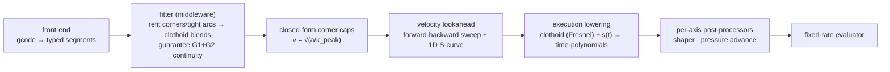

# Architecture — motion-pipeline rewrite

The decided design, authored from working through it (not a brain dump). Companion to `SPEC.md`. Where a claim was *not* pressure-tested in discussion, it is marked **[carried]** — those came from the original map and are provisional.

## Pipeline

Each arrow is a testable interface. The IR is progressively enriched: geometry → +caps → +timing. The MCU/execution transport and the structured-logging layer below the evaluator are reused unchanged.

## Representation (IR)

- **Two channels, not one.** A move is a *spatial path* plus a *follower channel* (extrusion). κ(s) describes only the path; it says nothing about E. This is already built in code (`FollowerDemand { axis_index, ratio }`); preserve it.
- **Typed segment library:** `enum Segment { Line | Arc | Clothoid }`. Each is closed-form in design space — no generic numerical integration, no `dyn`.
- **κ(s) is a derived scalar field, not the generative truth.** The typed segment is the source of truth; κ is read off it for the velocity law. The justification for centring on curvature is **"curvature is the coordinate the constraint is written in"** (`v = √(a/κ)`), *not* the fundamental theorem of plane curves (which is a 2-D theorem and oversells κ as "the representation").
- **Pure retraction** (`G1 E-` with no XYZ) is a **virtual-path** segment: zero spatial length, the follower's own displacement becomes the move's arclength. Already implemented (`try_new_virtual`, odometer over the post-shaping signal).
- **Clothoid closed-form split.** A clothoid's position needs Fresnel integrals (not elementary), but its **κ(s) is linear and closed-form**. Velocity planning needs only κ → closed-form there; Fresnel is needed only at **execution lowering**. This is the cleanest vindication of the design/execution split, and it removes the current per-segment 1024-point arc-length table.

## Fitter (middleware)

- **Shaper-agnostic by authority, not by approximation.** The fitter never consults a shaper model and the planner never limits acceleration to avoid ringing. `max_accel` is the user's sovereign knob — chosen empirically for no ringing, because no resonance measurement is perfect. Clothoid smoothness *happens to* help the shaper; it is a one-way gift, never a negotiation. (This deliberately drops the original map's "shaper-aware middleware / post-shaper within δ" goal — see Non-goals.)
- **Inputs do two different jobs.** `δ` (junction deviation) bounds the *geometry* — pick the gentlest clothoid that rounds the corner within δ, which maximises corner speed. `max_accel` is the *criterion for whether a corner even needs a blend* (a corner already takeable at full speed is left alone) and sets the *speed* on the blend via `v=√(a/κ)`. Not redundant.
- **Output guarantees:** all segment boundaries are collinear (G1) and curvature-continuous (G2), **except move starts** (nothing to be collinear to). Tight arcs get clothoid entry/exit transitions; gentle arcs pass through. This is what "refit the G1 stream into continuous motion" means.
- **Knob continuity with Klipper:** Square Corner Velocity reused — `SCV = √(a_max/κ_peak(90°, δ))`. The corner-angle dependence is closed-form clothoid geometry (`κ_peak(angle, δ)`), not an empirical ratio.

## Continuity and jerk

- **Acceleration continuity = two mechanisms.** Lateral (centripetal) = curvature continuity → the *fitter's* job (clothoids, κ never steps). Tangential (`a_t = v·dv/ds`) = the *velocity planner's* job, automatic when a boundary is a **single shared sample node** in the joint sweep.
- **Lateral jerk is free.** On a clothoid the acceleration vector stays at magnitude `a_max` and just *rotates* — braking → centripetal (apex) → forward — so lateral jerk is finite and bounded by the geometry. No lateral-jerk constraint in the planner. (At a line→clothoid boundary, κ is continuous but `dκ/ds` steps: a finite jerk step, fine for G2.)
- **Tangential jerk is a 1D S-curve in the lookahead — not a post-processor.** The only infinite-jerk source left is the **accel→decel reversal** (`+a_max → −a_max`), which lands with *no room* on a short straight between two features. A post-processor cannot fix this (it cannot lower a speed it already committed to). The lookahead can: on a short straight it **trims peak velocity** so the bounded-jerk reversal fits. This costs a sliver of time and zero geometry change.
- **Why it must be lookahead (causality).** Both jerk-rounded ramps take more time; the difference is direction. Acceleration smoothing borrows from *future* cruise (free). Deceleration smoothing borrows from *past* cruise (committed) — you must start braking sooner, which only foresight can reserve.
- **Jerk lives in `s(t)`, never in geometry.** The fitter owns the path; jerk-limiting only changes *when along the fixed path* you brake. Therefore it can produce **no geometric artifact** — its only costs are time and required braking length. If a segment genuinely cannot absorb its own smoothing, **fail loudly**.
- **The jerk limit is real, not a never-bind guard.** Its purpose is to let `max_accel` rise to the no-ring ceiling. It binds on short straights (where it trims peak velocity) and barely binds on long ones.

## Velocity planning (replaces the SOCP)

- **No convex solver.** Once lateral handling is in the geometry (closed-form corner caps) and tangential jerk is 1-D, the velocity problem *separates* into the classic forward-backward integration TOPP + closed-form S-curve ramps. The current SOCP + SLP9 + iterative joining existed to handle jerk *coupled* with curvature; decoupling them removes it. **This is the real-time win.**
- **Corner caps are precomputed, closed-form:** clothoid apex `v = √(a_max/κ_peak)`. Each clothoid also carries a *pointwise* cap `v ≤ √(a/κ(s))`; the apex binds.
- **The velocity profile over a clothoid is an output, not a local rule.** The same clothoid geometry can be traversed all-decel, all-accel, a dip, or cruise — the global sweep decides. Stop picturing "decel-in / accel-out"; picture a varying speed ceiling with one continuous line drawn under it.
- **Tighter-next-feature = ordinary backward propagation.** A tighter corner B's lower cap propagates upstream; if A's exit is within coupling range, A simply never accelerates out. If even max jerk-limited braking can't shed enough speed in the available distance, the backward pass continues past A (lowering A's cap too) until it finds slack or a full stop.
- **Coupling horizon = lookahead window, reset at every full stop.** Moves start and end at `v=0`, so a full stop always terminates the cascade and bounds the window.

## Shaper & pressure advance (execution)

- Stay **per-axis, time-domain post-processors at execution.** Never baked upstream of velocity planning.
- The **extruder follower advances on the post-shaper (realized) velocity** — already implemented via an odometer over the shaped signal, so PA reflects actual filament speed.
- **TODO (after basic movement):** the follower currently computes its full profile from the post-IS shape; investigate whether that can be simplified. Out of scope for now.

## Build sequence (walking skeleton)

1. Typed-segment IR + follower channel (largely exists) + tests.
2. Execution lowering from IR at constant speed — observability first.
3. Front-end gcode → typed segments (G0/1/2/3 → Line/Arc, drop G5).
4. Fitter: corners/tight-arcs → clothoid blends, G1+G2 guaranteed.
5. Velocity planning: forward-backward sweep + closed-form caps, **constant-speed-per-feature** rule (mainline-parity skeleton).
6. Tangential 1-D S-curve (jerk) in the lookahead.
7. **Limit-riding through clothoids** (the budget-trading speed upgrade) — swap the per-feature velocity rule without touching the fitter or the S-curve. Measure the gain against the skeleton.

## Decided non-goals (and why they're safe to drop)

- **Shaper-aware fitter / post-shaper-within-δ.** Authority decision: the planner never caps accel for ringing. δ is pre-shaper geometry only. Recoverable later — the fitter is just a pass.
- **G5 input** — no slicer emits it.
- **Helical G2/G3** — no slicer emits it; fail loudly (pending: fold Z as dependent axis instead).
- **Per-axis / anisotropic body**, **non-convex SLP jerk TOPP**, **whole-print benchmarking / ultimate-speed tuning** — see `SPEC.md`.

## Corrections to the original map (preserved rationale)

- The map's "core mistake: one Bézier served as design + execution, so TOPP ran on the execution format" is **inaccurate** — the current TOPP *does* reparameterize to arc length and build a curvature-based SOCP. The real costs are jerk-in-the-convex-core (SLP9), iterative joining, and the arc-length table. The representation switch attacks only the table; **jerk-out-of-the-core is the dominant real-time lever.**
- "κ(s) + anchor = the curve (fundamental theorem of plane curves)" oversells κ — it's a *planar* theorem and κ is a derived field. The typed segments are the representation.
- "The fitter must be shaper-aware" is **reversed** — it is deliberately shaper-agnostic.
- A cubic Bézier **cannot** exactly represent the fastest corner (a polynomial can't hold constant curvature, and the optimal ramp isn't in the cubic family) — but this is not an expressiveness wall; the real reason to design in curvature is that the constraint is written in κ.

## Carried, not yet pressure-tested

These remain from the original map and have **not** been examined in discussion — treat as provisional until challenged: the convex-body shape (global scalar XY disk × Z), the 3D planar pairwise-blend solver (2-D solve embedded via a basis transform, "no torsion"), bed-mesh-Z as a dependent axis, and dumb-gcode chain-vs-corner reconstruction.
