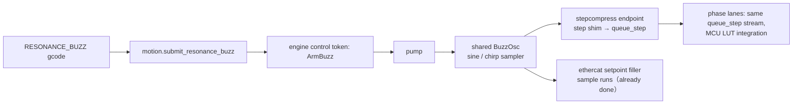

# Host-generated resonance buzz (stepqueue branch)

## Problem

The stepqueue branch makes classic `queue_step` the single MCU motion path and
deletes the MCU-resident sample/piece machinery. The resonance buzz is the last
consumer of MCU-side waveform math: `kalico_resonance_buzz` arms an on-MCU tone
generator (`rust/runtime/src/buzz_gen.rs` + `buzz_stream.rs` + `buzz_sweep.rs` +
`buzz_xdirect.rs`) that injects edges into the same runtime step queues that
classic motion uses. That cohabitation is structurally fragile (lane/step-queue
rejection checks, xdirect routing bits, refill-fault latch, foreground refill
hook in `engine/tick.rs`) and blocks deleting the runtime step queues.

EtherCAT already solved this the right way: the endpoint **rejects**
`ResonanceBuzz` (`ERR_BUZZ_IN_RING_MODE`, `ethercat-rt/src/endpoint/commands.rs`)
and the host's setpoint filler generates the buzz as ordinary sample runs
(`BuzzOsc` in `ethercat-rt/src/buzz.rs`, armed via
`setpoint_fill.rs::arm_buzz`). The buzz is "a sample source like any other".

Plan: do the same for step/dir MCUs. The buzz becomes a host-generated
`queue_step` stream; the MCU keeps zero waveform knowledge.

## How upstream Klipper does it

Upstream `resonance_tester.py` vibrates the toolhead through the **normal
planner**: per test frequency it issues short back-and-forth `toolhead.move()`
segments at `accel = accel_per_hz * freq` with the accel limit temporarily
raised. Constant-accel half-periods = square acceleration wave = triangle
velocity wave = piecewise-parabolic position. It works because the moves are
legal planner moves; the cost is the planner's junction/accel machinery in the
loop and a harmonically dirty (triangle) excitation.

We deliberately diverge on two points:

1. **Pure sine position wave**, not triangle velocity. A single-frequency sine
   has all its energy at the test frequency — cleaner PSD, same reason the
   current MCU tone generator is sinusoidal. Peak accel = `A·ω²`, checked
   against `max_peak_accel` exactly as today (`resonance_buzz.py` already does
   this on the host).
2. **Bypass the planner entirely.** The buzz must not pass through the fitter /
   planner / lowerer / shaper (`setup_pipeline` in `motion-core/src/worker.rs`):
   jerk limits would round the peaks, velocity limits would clip, input shaping
   would notch out the very frequency under test, and PA/extruder coupling is
   meaningless. Injection happens **below** the pipeline, at the transport
   sink — mirroring where the EtherCAT `BuzzOsc` already sits.

## Architecture

One shared oscillator, three transports, one injection seam.

### 1. Shared generator

Extract/generalize `ethercat-rt/src/buzz.rs::BuzzOsc` into a transport-neutral
module (likely `motion-core`, since both the pump's stepcompress sink and the
EtherCAT filler are host-side; `ethercat-rt` can depend on it or re-export).
It produces **absolute lane positions** `x(t) = base + sign·A(t)·sin(ω(t)·t)`
sampled on a uniform grid:

- Fixed tone: constant `ω`; sweep: continuous chirp (`mu` term, as
  `buzz_gen.rs::ToneParams` has today).
- Ramp envelope `A(t)`: linear fade-in/out over `ramp_ms`, one envelope for a
  whole sweep (current `RESONANCE_BUZZ_SWEEP` semantics).
- Net-zero guarantee: the envelope ends at zero amplitude and the generator
  ends exactly at `base`, so step counters and kinematic position are
  unchanged. Assert this at close.

The EtherCAT filler switches to the shared module; its behavior must not
change (`setpoint_fill/tests.rs::a_buzz_streams_through_the_same_runs` pins
it).

### 2. Step/dir transport: buzz as a sink-level source

The stepcompress endpoint (`motion-core/src/pump/stepcompress_sink.rs`)
already turns evaluated positions into `queue_step`/`queue_step_hp` frames via
the step shim, paced by `SEND_LEAD_SECONDS` against the projected MCU clock.
Add a buzz source that feeds the same shim:

- Sample the oscillator at `stepcompress_sample_rate` (the internal 20 kHz
  default) and push the resulting positions through the existing shim path —
  identical quantization and encoder (`hp`/`classic`) as normal motion. No new
  wire commands; the MCU sees plain `queue_step` frames.
- Arm/disarm mirrors EtherCAT `arm_buzz` rules exactly:
  - reject while the lane still has queued trajectory (loud error, no
    padding);
  - reject a second buzz while one is active (`ERR_BUZZ_BUSY` equivalent);
  - `amplitude == 0` form disarms.
- The buzz anchors on the lane's current held position and its own epoch
  (as EtherCAT does: "the trajectory epoch must not continue into it").
- `wants_drain`/`wants_drain_tick` (`pump/messages.rs`) must report true while
  a buzz outlives one fill window, so the pump keeps draining with no
  trajectory queued — same contract the EC filler already implements.

### 3. Command plumbing

- `klippy/extras/resonance_buzz.py::submit_buzz`: delete the raw
  `kalico_resonance_buzz` MCU-command branch. Step/dir axes route through the
  same engine call servo axes use; the engine resolves transport per lane
  (stepcompress vs ethercat) internally. Host-side validation
  (`max_peak_accel`, `max_amplitude`) stays where it is.
- Engine side: new control token through the pump front door
  (`worker/ingress.rs` control tokens) or a direct pump message —
  `ArmBuzz { axis_mask, sign_mask, freq_start, freq_end, amplitude, duration,
  ramp }` — fanned to each owning endpoint. Completion: klippy already sleeps
  `duration`; add a barrier/ack so `wait_moves`-style code can confirm the
  tail flushed (stepcompress barriers exist and fit).
- Delete `runtime_resonance_buzz` FFI (`c-api`, `runtime_ffi/exports/phase_buzz.rs`),
  `engine/manual.rs::resonance_buzz`, and the `kalico_resonance_buzz` command
  registration.

### 4. Phase stepping

Nothing extra. In the stepqueue architecture a phase lane consumes the same
`queue_step` stream and integrates signed step counts through the sin/cos LUT
into XDIRECT writes. The buzz is just another step stream. The one caveat —
adjusting phase-write *timing* so the physical output actually lands on the
sine peaks rather than the quantized step edges — is acknowledged and **out of
scope**; it lives entirely in the MCU phase-execution logic and does not
affect generation. `buzz_xdirect.rs` (MCU-side Clenshaw/xdirect tone) is
deleted with the rest.

### 5. EtherCAT

Already host-generated. Work here is only: move `BuzzOsc` to the shared
module, keep the wire protocol (`ResonanceBuzz` message → filler `arm_buzz`)
untouched, keep the endpoint rejection for endpoint-side buzz.

## Deletions

- `rust/runtime/src/buzz_gen.rs`, `buzz_stream.rs`, `buzz_sweep.rs`,
  `buzz_xdirect.rs`, `buzz.rs` (+ their test dirs).
- `buzz_stream` hooks in `engine/manual.rs`, `engine/tick.rs`,
  `engine/sample.rs` (`is_xdirect` checks), `dispatch_stepper` foreground kick,
  `runtime_buzz_refill_foreground` C export and its C caller.
- `runtime_resonance_buzz` in `c-api/include/runtime.h` and
  `runtime_ffi/exports/phase_buzz.rs`.
- `kalico_resonance_buzz` MCU command and its lookup in `resonance_buzz.py`
  (including the "rebuild and reflash" error).
- Buzz-vs-lane conflict faults (`BUZZ_REJECT_LANE_ANCHORED`, refill-fault
  codes in `log_codes.rs`) — replaced by host-side loud rejections.

## Error policy (per repo rules)

All conflicts fail loudly on the host: buzz over an active trajectory, buzz
over buzz, buzz exceeding `max_peak_accel`/`max_amplitude`, buzz on a lane
with no transport. No clamping, no deferral.

## Sequencing

1. Extract shared sine/chirp oscillator; port EtherCAT filler onto it
   (behavior-pinned by existing `setpoint_fill` tests).
2. Add buzz source to the stepcompress endpoint + pump drain plumbing +
   `ArmBuzz` control path; unit tests: net-zero step count, sample-rate
   spacing, rejection while trajectory queued, pacing under `SEND_LEAD`.
3. Reroute `resonance_buzz.py` to the engine call for step/dir axes.
4. Delete the MCU-side buzz stack and its FFI/commands/log codes.
5. Sim e2e: `RESONANCE_BUZZ` / `RESONANCE_BUZZ_SWEEP` / `TEST_RESONANCES` in
   `tools/sim`; assert position returns to base and no faults.
6. Bench: Trident (phase lanes + step/dir), later EBB36 extruder lane over
   CAN — the buzz now exercises the exact classic path a toolboard uses.

## Open questions

- Injection point granularity: feed the shim positions directly vs synthesize
  short pieces for the existing piece→shim path. Direct positions are simpler
  and avoid faking planner pieces; verify the shim API allows a non-piece
  source cleanly.
- Buzz on a multi-motor rail (CoreXY coupled masks): current MCU path arms
  per-axis step queues from `axis_mask`; host path must map motor masks to
  lanes/oids the same way `resonance_buzz.py::buzz_axis_to_motor_mask` does
  today — audit sign handling for coupled in-phase/anti-phase modes.
- Whether `RESONANCE_BUZZ_SWEEP`'s STEP/DIR "fixed-frequency staircase" (per
  its help text) should become a continuous chirp now that generation is
  host-side and unified — likely yes; cheaper and cleaner, but changes sweep
  semantics, so decide explicitly.
